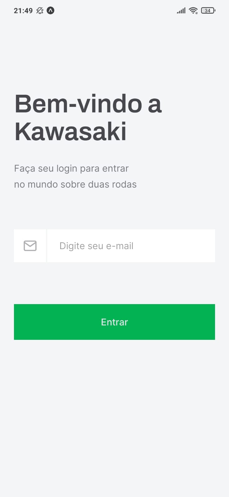
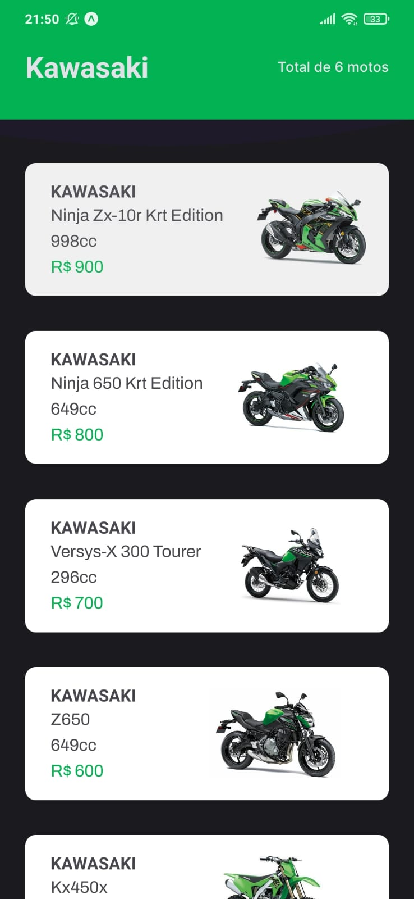
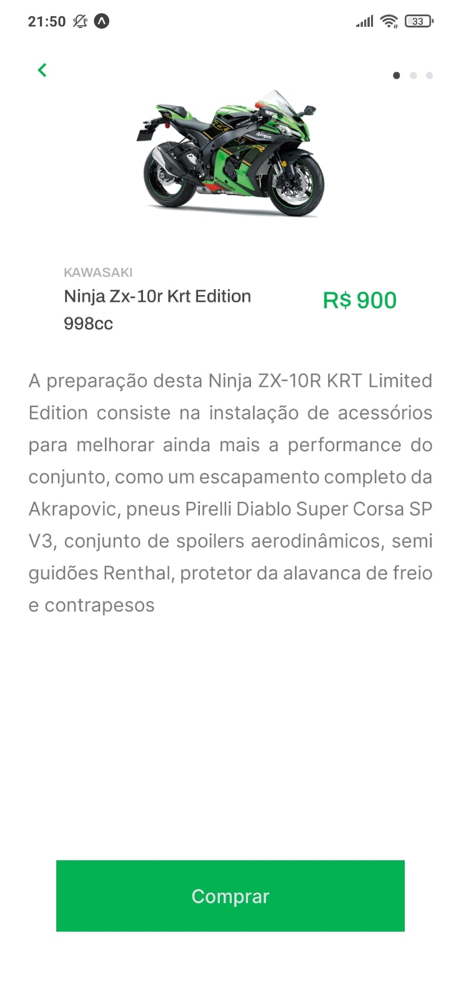
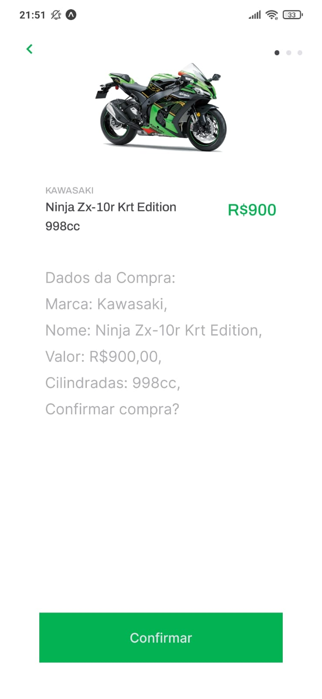
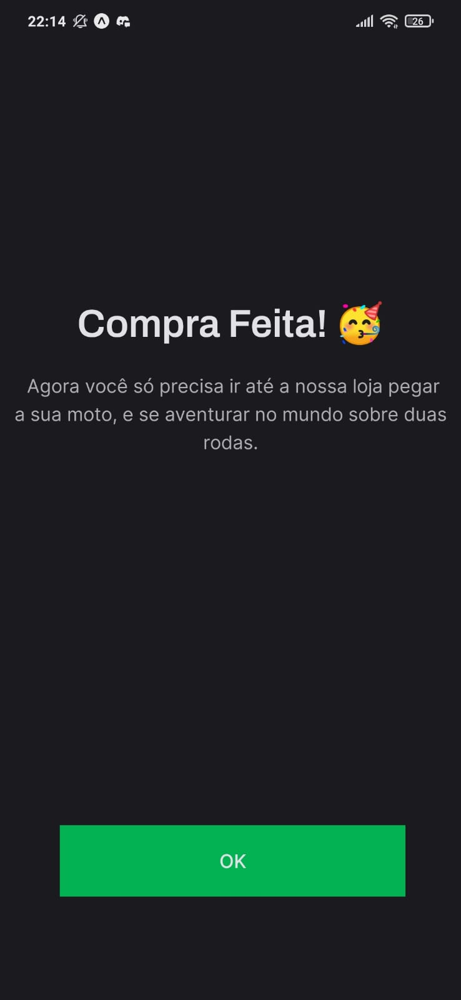

# Documentação Moto X
### Requerimentos: 
1.  Node === 16.14.2
2.  Instalação de Ambiente Expo `npm i -g expo-cli`
3.  Instalação de Json-serve `npm i -g json-server`
4.  Android Studio (PARA INSTALAÇÃO NO EMULADOR)
5.  Git
6.  Java openjdk 11.0.15 (PARA INSTALAÇÃO NO EMULADOR)
7.  Expo Go (PARA INSTALAÇÃO NO EXPO GO)

### Instalação Expo Go
- Baixar o Expo Go na appstore para iphone ou playstore para android
- Criar uma conta
1. `cd path/to/project && git clone `
2. Pegar ip da sua máquina pois é necessário para rodar junto com o Json-server (para Ubuntu) `Ip a`
3. No arquivo package.json linha 10 substituir `valor-do-ip` por ip adquirido no passo anterior
4. No arquivo `src/services/api.ts` linha 4 subsituir `valor-do-ip` por valor adquirido no passo 2
5. `cd path/to/project && yarn install`
6. Para rodar a API, utilizar o comando `yarn api`
7. `expo start` (computador e smartphone devem estar conectados na mesma rede)
8. `Colocar seu dispositivo físico para ler o QR code e abrir o projeto`

### Instalação Emulador
1. `cd path/to/project && git clone `
2. Pegar ip da sua máquina pois é necessário para rodar junto com o Json-server (para Ubuntu) `Ip a`
3. No arquivo package.json linha 10 substituir `valor-do-ip` por ip adquirido no passo anterior
4. No arquivo `src/services/api.ts` linha 4 subsituir `valor-do-ip` por valor adquirido no passo 2
5. `cd path/to/project && yarn install`
6. Para rodar a API, utilizar o comando `yarn api`
7. `npx react-native start`
8. `yarn android`
9. 

### Imagens

